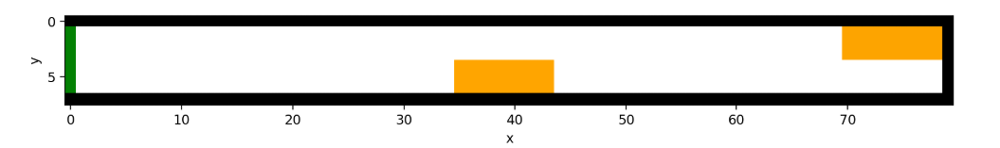
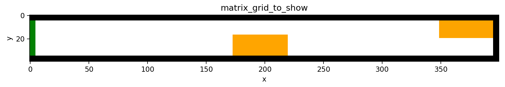
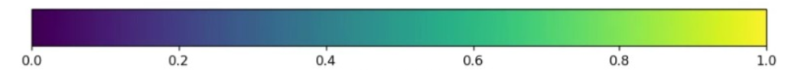
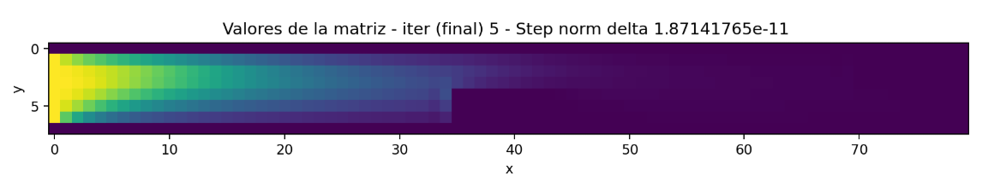
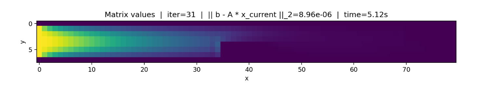
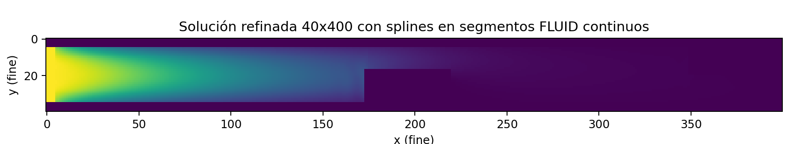

# 🌀 Navier–Stokes Fluid Simulation (Python)

This repository contains a numerical simulation of an incompressible 2D fluid flowing through a domain with obstacles, using the Navier–Stokes equations discretized with finite differences.  
The project includes:

- A **nonlinear solver** (Newton–Raphson)
- Multiple **iterative linear solvers** (Jacobi, Gauss–Seidel, Richardson, SOR, Gradient Descent, Conjugate Gradient)
- A module for **bidimensional cubic spline interpolation** to refine the solution from a coarse grid to a high-resolution grid

---

## 📁 Project Structure

```text
sistema_no_lineal/
 └── newton_raphson.py          # Nonlinear solver for Navier–Stokes

sistemas_lineales/
 ├── conjugate_gradient.py
 ├── gauss_sidel.py
 ├── gradient_descent.py
 ├── jacobi.py
 ├── richardson.py
 ├── sor.py
 └── utils.py                   # Matrix and helper functions

splines/
 ├── cubic_spline.py            # Main 2D spline interpolation
 ├── cubic_spline_backup.py
 └── transposing_matrix.py

images_results/
 ├── 8x80.png
 ├── 40X400.png
 ├── color_range.png
 ├── newton-raphson.png
 ├── sor.png
 └── splines.png

random_tests_sistemas_lineales.py
transposing_matrix.py
workshop1/
```

---

## 🔧 Installing Dependencies

### 🟣 Using Anaconda (Recommended)

You can run this entire project using **Anaconda** with an isolated environment.

1️⃣ Create a Conda environment with Python **3.12.7**:

```bash
conda create -n navier python=3.12.7
```

2️⃣ Activate the environment:

```bash
conda activate navier
```

3️⃣ Install dependencies from `requirements.txt`:

```bash
pip install -r requirements.txt
```

---

### 🟦 Alternative: Using a Virtual Environment (venv)

```bash
python -m venv .venv
source .venv/bin/activate       # Linux / Mac
.venv\Scripts\activate        # Windows
pip install -r requirements.txt
```

---

## 🚀 Running the Code

> **Important:** All examples assume you run the commands from the **root folder** of the repository.

### ▶️ Nonlinear Solver (Newton–Raphson)

```bash
python -m sistema_no_lineal.newton_raphson
```

This script:

- Builds the computational grid  
- Assembles the nonlinear Navier–Stokes system  
- Solves it using Newton–Raphson  
- Uses one of the iterative linear solvers internally  
- Produces the coarse-grid velocity field  

---

### ▶️ Run Linear Solvers Individually

```bash
python -m sistemas_lineales.jacobi
python -m sistemas_lineales.gauss_sidel
python -m sistemas_lineales.sor
python -m sistemas_lineales.richardson
python -m sistemas_lineales.gradient_descent
python -m sistemas_lineales.conjugate_gradient
```

Each module runs a test problem and reports convergence information (iterations, residual, time).

---

### ▶️ Run the 2D Spline Interpolation

Refine the 8×80 solution to the 40×400 grid:

```bash
python -m splines.cubic_spline
```

This script:

- Rebuilds the velocity field on the coarse (8×80) grid  
- Applies cubic spline interpolation in \(x\) and \(y\)  
- Produces a smooth field on the fine 40×400 grid  

---

### ▶️ Random Linear-System Tests

```bash
python -m random_tests_sistemas_lineales
```

Used to compare convergence and performance of the different linear solvers.

---

## 📊 Results Preview

The `images_results/` folder contains example outputs generated by the scripts.

### 🧱 Geometry and Grids

**Coarse 8×80 grid with inlet and obstacles:**



**Fine 40×400 grid used for visualization after refinement:**



---

### 🎨 Colormap

The simulations use a continuous colormap for the velocity magnitude:



---

### 🧮 Newton–Raphson Solution (Nonlinear System)

Example of the converged velocity field on the 8×80 grid, obtained with the **Newton–Raphson** nonlinear solver:



---

### ⚙️ SOR Linear Solver

Example of the velocity field when solving the linear system with the **SOR (Successive Over-Relaxation)** method:



---

### 📈 Spline-Based Refinement (40×400)

The coarse solution is prolonged to the fine 40×400 grid using 2D cubic splines, producing a smooth field that respects the boundaries and obstacles:



---

## 📌 Notes

- The design is modular: nonlinear and linear solvers, as well as interpolation, are separated into different packages.
- The spline module can be reused as a general 2D grid refinement tool.
- Only standard scientific Python packages are required (NumPy, Matplotlib, etc.).

---

## 📄 License

This project is for academic and research purposes.  
You may modify or extend it freely.
